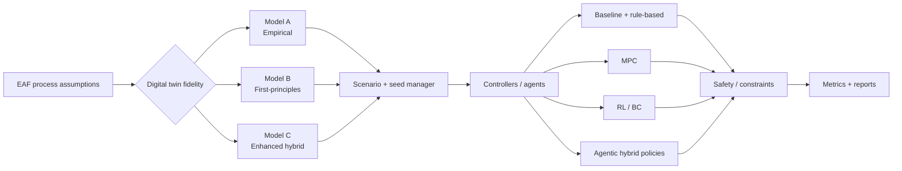

# EAF Cognitive Twin

[](https://github.com/vtavakkoli/eaf-cognitive-twin/actions/workflows/pr-test.yml)


**EAF Cognitive Twin** is a research-grade, multi-fidelity digital-twin benchmark for evaluating control strategies and agentic AI in **electric arc furnace (EAF) steelmaking**. The repository provides a common simulation environment, reproducible scenarios, multiple controller families, safety-aware evaluation, training/evaluation runners, automated tests, and report generation.

> **Research status.** This repository supports the AI2M4RI 2026 work **“Evaluating Agentic AI in EAF Steelmaking: A Multi-Fidelity Digital Twin Benchmark,”** accepted and presented in Athens, Greece, August 18–20, 2026. It is a simulation and benchmarking platform—not a certified industrial control system and not a substitute for plant-specific engineering validation.

## Publication

**Tavakkoli, V., Mohsenzadegan, K., & Kyamakya, K. (2026). _Evaluating Agentic AI in EAF Steelmaking: A Multi-Fidelity Digital Twin Benchmark._ Accepted and presented at the International Workshop on AI and Mathematical Methods for Real-world Impact (AI2M4RI), in conjunction with the 23rd International Conference on Mobile Systems and Pervasive Computing (MobiSPC), Athens, Greece, August 18–20, 2026.**

If you use this repository, benchmark design, models, evaluation workflow, figures, tables, or results, please cite the paper. See [Citation](#citation) and [`CITATION.cff`](CITATION.cff).

## Why this repository exists

Agentic and learning-based controllers can appear strong when evaluated on a single simplified simulator or under inconsistent scenarios. EAF Cognitive Twin is designed to make those comparisons more disciplined by providing:

- **three simulator fidelity levels** under one codebase;
- **shared scenarios, seeds, constraints, and metrics** for fair policy comparison;
- **classical, rule-based, optimization-based, RL, imitation-learning, and hybrid agentic policies**;
- **safety filtering and operational constraints** around controller actions;
- **repeatable training and evaluation commands**;
- **unit, integration, policy, stability, and benchmark-runner tests**;
- **Docker-based execution** for environment portability;
- **machine-readable and human-readable reports** for downstream analysis.

## System overview



The benchmark defaults to **Model C** for the main agentic-policy comparisons while retaining Models A and B for fidelity studies, ablations, sanity checks, and physics-oriented analysis.

## Digital-twin hierarchy

| Model | Implementation | Fidelity | Intended use |
|---|---|---:|---|
| **Model A – Empirical** | `src/eaf_twin/models/empirical.py` | Low | Fast baseline, sanity checks, rapid experiments |
| **Model B – First-principles** | `src/eaf_twin/models/first_principles.py` | Medium / high | Physics-grounded analysis and interpretable ablations |
| **Model C – Enhanced hybrid** | `FirstPrinciplesModel(enhanced=True)` | Highest in this repository | Main benchmark, agentic control, safe RL, policy comparison |

### Model C benchmark role

`Model_C_enhanced_hybrid = FirstPrinciplesModel(enhanced=True)`

Model C extends the first-principles formulation with richer process behaviour, including phase/melting dynamics, chemical-energy interactions, foamy-slag/arc-efficiency effects, tapping logic, operational constraints, and sensor noise. It is the preferred benchmark simulator when comparing controllers under a common closed-loop environment.

## Controller and agent families

The repository includes or exposes benchmark runners for the following policy families:

- `baseline_schedule`
- `rule_based`
- `mpc`
- `trainable_adaptive_controller`
- `q_learning`
- `dqn`
- `ppo`
- `goal_conditioned_jepa_ppo`
- `behavior_cloning`
- `sac_td3_inspired_heuristics` *(when enabled in the selected benchmark configuration)*
- `safe_ppo_agentic_mpc`
- safe PPO / agentic hybrid variants available to the runner

### Goal-conditioned JEPA-PPO-TD3BC path

```text
current multimodal EAF state
        ↓
TD3 smooth target + behavior-cloning prior
        ↓
short-horizon TD3BC goal embedding
        ↓
JEPA latent next-state predictor
        ↓
PPO policy head + simulator safety filter
        ↓
safe EAF control action
```

The goal-conditioned path keeps PPO as the adaptive policy while TD3+BC supplies a short-horizon operating target to the JEPA predictor. This separates goal construction from final action selection and keeps the safety filter in the execution path.

## Repository layout

```text
.
├── agents/                  # Agent policies, training/evaluation runners
├── configs/                 # Reproducible benchmark configurations
├── docs/                    # Architecture, assumptions, roadmap, reproducibility
├── outputs/                 # Generated simulation/benchmark outputs
├── src/eaf_twin/
│   ├── config/              # Configuration support
│   ├── domain/              # EAF domain abstractions
│   ├── estimation/          # State/parameter estimation
│   ├── io/                  # Input/output utilities
│   ├── models/              # Empirical and first-principles digital twins
│   ├── reporting/           # Result/report generation
│   ├── simulation/          # Simulation orchestration
│   └── validation/          # Validation utilities
├── tests/                   # Unit and integration test suite
├── Dockerfile
├── docker-compose.yml
├── pyproject.toml
└── CITATION.cff
```

## Quick start

### 1. Local Python environment

Requirements: **Python 3.12+**.

```bash
git clone https://github.com/vtavakkoli/eaf-cognitive-twin.git
cd eaf-cognitive-twin

python -m venv .venv
source .venv/bin/activate        # Linux/macOS
# .venv\Scripts\activate       # Windows PowerShell

python -m pip install --upgrade pip
pip install -r requirements.txt
pip install -e .
```

Run the test suite:

```bash
python -m unittest discover -s tests -v
```

Run a simulator smoke test:

```bash
python -m eaf_twin.cli run \
  --config configs/base_case.json \
  --output-dir outputs/smoke
```

### 2. Docker

```bash
docker compose up --build build-agent
```

Individual stages:

```bash
docker compose up --build train-agent
docker compose up --build run-agent
```

## Reproducible experiments

### Training examples

```bash
python -m agents.runners.train_agent \
  --config configs/base_case.json \
  --algorithm q_learning \
  --episodes 500 \
  --seed 7 \
  --output-dir results/agent_training/q_learning

python -m agents.runners.train_agent \
  --config configs/base_case.json \
  --algorithm dqn \
  --episodes 500 \
  --seed 7 \
  --output-dir results/agent_training/dqn

python -m agents.runners.train_agent \
  --config configs/base_case.json \
  --algorithm ppo \
  --episodes 1000 \
  --seed 7 \
  --output-dir results/agent_training/ppo

python -m agents.runners.train_agent \
  --config configs/base_case.json \
  --algorithm goal_conditioned_jepa_ppo \
  --episodes 1000 \
  --seed 7 \
  --output-dir results/agent_training/goal_conditioned_jepa_ppo

python -m agents.runners.train_agent \
  --config configs/base_case.json \
  --algorithm safe_ppo_agentic_mpc \
  --episodes 1000 \
  --seed 7 \
  --output-dir results/agent_training/safe_ppo_agentic_mpc
```

### Main evaluation pattern

```bash
python -m agents.runners.run_agent \
  --config configs/base_case.json \
  --output-dir results/agent_run \
  --seeds 30 \
  --n-scenarios 6 \
  --model C \
  --max-steps 610 \
  --mpc-horizon 8 \
  --include-rl-baselines \
  --report-format html,csv,md
```

For experiment discipline, keep the configuration, simulator fidelity, scenario count, seed policy, maximum steps, and evaluation metrics fixed when comparing algorithms. See [`docs/reproducibility.md`](docs/reproducibility.md).

## Reproducibility and scientific-use checklist

Before reporting a benchmark result:

1. Record the Git commit SHA.
2. Record the Python/dependency environment or use the provided Docker setup.
3. Archive the exact configuration file.
4. Record training seeds and evaluation seeds separately.
5. Report the selected simulator fidelity (A, B, or C).
6. Use the same scenario set and termination conditions across compared policies.
7. Preserve raw outputs in addition to aggregate figures/tables.
8. Distinguish simulated evidence from plant-validated evidence.

## Continuous integration

Pull requests are checked with GitHub Actions using Python 3.12. The workflow installs the pinned dependencies and package, verifies the environment, runs the unit/integration suite, performs a short simulation smoke test, and uploads smoke-test artifacts for inspection.

## Documentation

- [`docs/architecture.md`](docs/architecture.md) — component architecture and data flow
- [`docs/assumptions.md`](docs/assumptions.md) — modelling assumptions and scope
- [`docs/reproducibility.md`](docs/reproducibility.md) — experiment protocol and reporting checklist
- [`docs/thermal_model_kelvin_note.md`](docs/thermal_model_kelvin_note.md) — thermal-model implementation note
- [`docs/roadmap.md`](docs/roadmap.md) — planned research extensions
- [`CONTRIBUTING.md`](CONTRIBUTING.md) — contribution and scientific-change guidance

## Scope and limitations

This software is intended for **research, benchmarking, reproducibility, and methodological evaluation**. Results produced by the simulator are not evidence of safe deployment on a physical furnace by themselves. Plant deployment would require site-specific calibration, instrumentation validation, process-hazard analysis, operator review, independent safety engineering, cybersecurity controls, commissioning, and compliance with the applicable industrial requirements.

The digital-twin fidelity labels describe relative fidelity **within this repository**; they should not be interpreted as certification against a specific industrial plant.

## Citation

### Preferred paper citation

Tavakkoli, V., Mohsenzadegan, K., & Kyamakya, K. (2026). **Evaluating Agentic AI in EAF Steelmaking: A Multi-Fidelity Digital Twin Benchmark.** Accepted and presented at the International Workshop on AI and Mathematical Methods for Real-world Impact (AI2M4RI), in conjunction with the 23rd International Conference on Mobile Systems and Pervasive Computing (MobiSPC), Athens, Greece, August 18–20, 2026.

```bibtex
@inproceedings{tavakkoli2026evaluating_agentic_eaf,
  author    = {Tavakkoli, Vahid and Mohsenzadegan, Kabeh and Kyamakya, Kyandoghere},
  title     = {Evaluating Agentic AI in EAF Steelmaking: A Multi-Fidelity Digital Twin Benchmark},
  booktitle = {International Workshop on AI and Mathematical Methods for Real-world Impact (AI2M4RI), in conjunction with the 23rd International Conference on Mobile Systems and Pervasive Computing (MobiSPC)},
  year      = {2026},
  address   = {Athens, Greece},
  note      = {Accepted and presented, August 18--20, 2026}
}
```

### Repository citation

```bibtex
@software{tavakkoli2026eafcognitivetwin,
  author  = {Vahid Tavakkoli and Kabeh Mohsenzadegan and Kyandoghere Kyamakya},
  title   = {EAF Cognitive Twin: Multi-Fidelity Digital-Twin Benchmark for Agentic AI in Electric Arc Furnace Steelmaking},
  year    = {2026},
  url     = {https://github.com/vtavakkoli/eaf-cognitive-twin}
}
```

## Contributing

Research contributions are welcome subject to the repository license and contribution guidance. Please read [`CONTRIBUTING.md`](CONTRIBUTING.md) before opening a pull request. Changes that affect physics, constraints, benchmark fairness, safety logic, metrics, or reported results should include an explanation of the scientific rationale and appropriate tests.

## License

This repository currently uses a **temporary research license** for academic review, reproducibility evaluation, and research verification. See [`LICENSE`](LICENSE) for the exact terms. Do not assume the permissions of MIT, Apache-2.0, or another OSI-approved license unless the repository is explicitly relicensed.

---

**EAF Cognitive Twin** — reproducible multi-fidelity benchmarking for safe, transparent evaluation of agentic AI and control strategies in EAF steelmaking.
